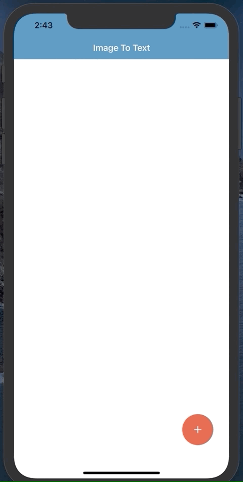

#  Vision

This project allows users to Take a Photo or Choose photo in library to process text in image to text and share to the world as you need

## Screen shot

### Getting Started and Introduce Application

### Choose a photo from library to process 

### Shared text and photo the world

### Any Languege 

## How to use this application
- Open ***Vision.xcworkspac***
- Open ***GoogleAPI.swift***
- In Line 19 `static let apiKey = ""`  Add your API Keys
- Run or `Cmd + R`

# License

